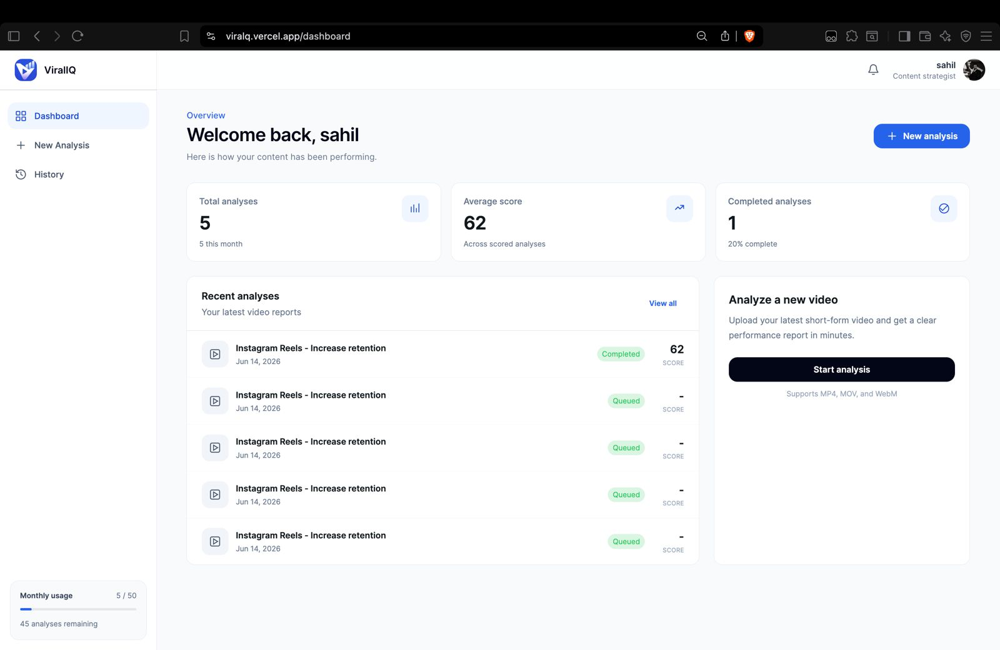

# ViralIQ

AI-powered short-form video analysis for creators and content teams.

ViralIQ uploads a video, extracts creative context, generates an AI performance report, and saves the results for future review.




## Features

- AI video scoring with overall, hook, engagement, retention, and content quality scores
- Saved analysis reports with strengths, weaknesses, recommendations, and improvement prediction
- Dashboard metrics based on the signed-in user's real analysis history
- History page with pagination and full report detail pages
- Supabase-backed video storage and report persistence
- Clerk authentication

## Tech Stack

- Next.js 15
- React 19
- TypeScript
- HeroUI
- Tailwind CSS
- Clerk
- Supabase
- OpenAI Responses API

## Environment Variables

Create a local `.env.local` file with:

```bash
NEXT_PUBLIC_CLERK_PUBLISHABLE_KEY=
CLERK_SECRET_KEY=
NEXT_PUBLIC_CLERK_SIGN_IN_URL=/sign-in
NEXT_PUBLIC_CLERK_SIGN_UP_URL=/sign-up
NEXT_PUBLIC_CLERK_SIGN_IN_FORCE_REDIRECT_URL=/dashboard
NEXT_PUBLIC_CLERK_SIGN_UP_FORCE_REDIRECT_URL=/dashboard

NEXT_PUBLIC_SUPABASE_URL=
NEXT_PUBLIC_SUPABASE_PUBLISHABLE_KEY=
SUPABASE_ANON_KEY=
SUPABASE_SERVICE_ROLE_KEY=

OPENAI_API_KEY=
OPENAI_MODEL=gpt-4.1-mini
```

## Development

```bash
npm install
npm run dev
```

Open `http://localhost:3000`.

## Scripts

```bash
npm run dev
npm run build
npm run lint
npm run typecheck
```

## Deployment

The app is deployed on Vercel:

```bash
npx vercel deploy --prod
```

Live site: https://viralq.vercel.app
